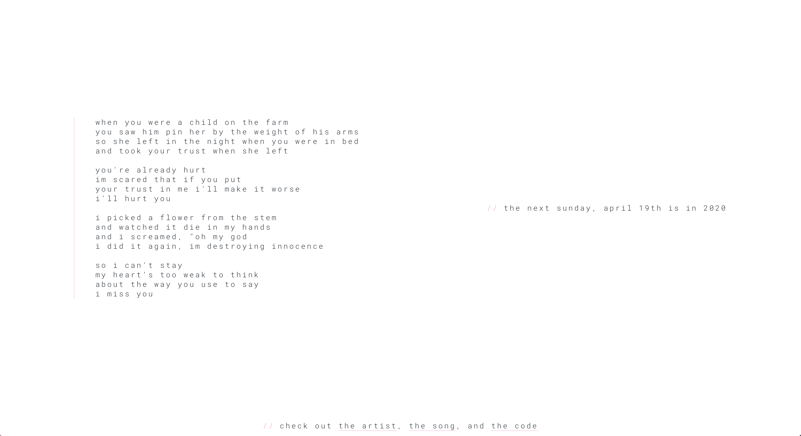

# sunday, april 19th
View the project [here](https://sunday-april-19th.herokuapp.com/).

This project is a reference to a song, [it's sunday, april 19th, and i miss you](https://www.youtube.com/watch?v=4x7Csbr-Owo) by one of my favorite artists, [flatsound](https://www.flatsound.org/).

## details
This calculates the next occurrence of sunday, april 19th, because you don't wanna miss it.

## code
This project is made with react for the front-end and a simple node back-end that calculates the next occurrence, running on Heroku.

## installation
1. Clone this repo and go into it.
`git clone https://github.com/novacourtois/sunday-april-19th && cd sunday-april-19`

2. Install things
`npm run installFiles`

3. Do a local build
`npm run dev`

4. Go to `localhost:3000` and you're all set

## screenshot

## license
You can do whatever you want with this code.